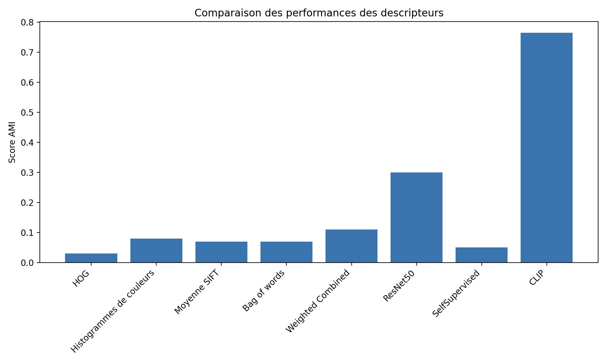

# Snacks clustering

Alaeddine Cheniour et Simon Khan

### Objectif : clusteriser des images de snacks par des méthodes d’apprentissage non supervisé

Voir le rapport pdf pour comprendre notre démarche et nos choix de descripteurs, métriques et modèles. 

### step 1 : téléchargement des données et installation des packages

installer les requierements : "pip install -r requierements.txt"

### step 2 : configuration du chemin vers les donnés

Dans le dossier src/constant.py, modifier la variable "PATH_DATA" par le chemin vers le dossier contenant les images à clusteriser. 

### step 3 :  run de la pipeline clustering

 - aller dans le dossier src
 - exécutez la commande : "python pipeline_mixed.py"

### step 4 : lancement du dashboard

- aller dans le dossier src 
- exécutez la commande : "streamlit run dashboard_clustering_mixed.py"

Le dash board contient 2 onglets : 

- Un onglet permettant une visualisation des clusters dans un espace en 3 dimensions. Dans cet onglet, il est possible de sélectionner un cluster ou un point d’un cluster pour visionner les images correspondantes.
- Un onglet permettant de consulter les métriques comme le score AMI, et si l’on a choisi le modèle KMeans : le score silouhette ou bien l’inertie en fonction de plusieurs valeurs de k.

## Résultats :

Notre meilleur descripteur est CLIP, comme le montre le graphique ci - dessous représentant le score AMI de chaque descripteur entrainé avec le modèle K-Means ++.

